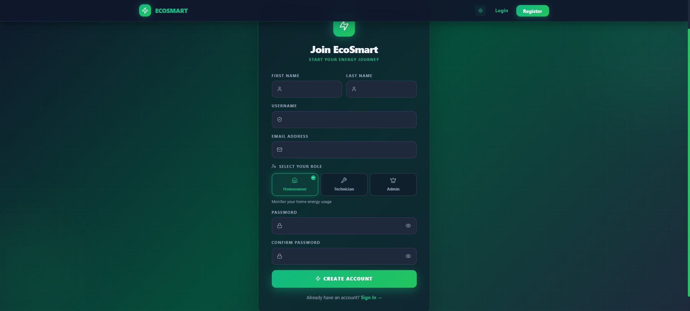
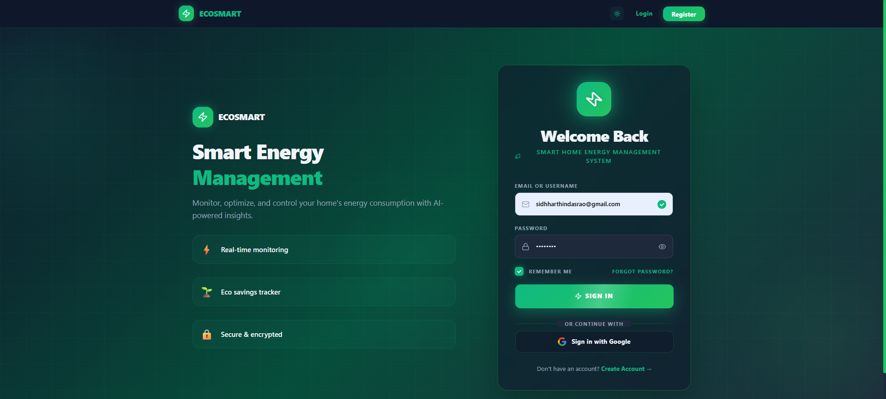

<div align="center">
  <h1>🌱 Smart Home Energy Management System</h1>
  <p><i>A full-stack, comprehensive web application designed to monitor, track, and optimize smart home energy consumption. Build with security, modern UI/UX, and performance in mind.</i></p>

  <!-- Badges -->
  <p>
    
    
    
    
    
    
  </p>

  <p>
    <a href="#-tech-stack">Tech Stack</a> •
    <a href="#-key-features">Features</a> •
    <a href="#-my-contribution-backend-developer">My Contribution</a> •
    <a href="#-screenshots">Screenshots</a> •
    <a href="#-getting-started">Getting Started</a> •
    <a href="#-api-endpoints">API</a> •
    <a href="#-contributing">Contributing</a>
  </p>
</div>

---

## 📖 Overview

The **Smart Home Energy Management System** allows homeowners to track their energy usage effortlessly, helping reduce carbon footprints and electricity bills. Built with a robust backend and a highly interactive front end, it securely manages real-time monitoring and user roles.

<br/>

## 🛠️ Tech Stack

### Backend Infrastructure
- **Core Platform:** Java 17, Spring Boot 3.4.2
- **Security:** Spring Security, JWT (JSON Web Tokens), OAuth2 integration, BCrypt for password hashing
- **Persistence:** Spring Data JPA, Hibernate, MySQL 8
- **Build Tool:** Maven

### Frontend Experience
- **Core Library:** React 19 (Hooks-heavy architecture)
- **Tooling:** Vite for lightning-quick builds
- **Styling:** Tailwind CSS 4, UI Component Ecosystem
- **Animations:** Framer Motion for smooth, highly professional micro-interactions
- **Networking/Routing:** Axios for API requests, React Router for seamless SPA navigation

<br/>

## ✨ Key Features

### 🔒 Enterprise-Grade Security
- **JWT-Based Authentication**: Secure session handling for the API layer.
- **Robust Registration Flow**: Email validation, one-time passwords (OTP), and encrypted credentials.
- **OAuth2 Login**: Google Sign-In capability mapping correctly to native user accounts.
- **Role-Based Access Control (RBAC)**: Fine-grained permissions for Homeowners, Technicians, and Admins.

### 🍃 Exceptional User Interface & UX
- **Beautiful Theming**: A deep, rich Emerald/Green palette emphasizing eco-friendliness and sustainability.
- **Responsive Layout**: Seamlessly transition from desktop dashboard to mobile interfaces.
- **Glass-Morphism Aesthetics**: Modern, frosted UI panels emphasizing clean data presentation.
- **Animation Suite**: Smooth page transitions and dynamic data pop-ins configured with Framer Motion.

### 🔋 Energy & Device tracking
- Add, update, and manage connected home devices.
- Generate and visualize power usage data simulating real energy meters.
- Analyze device uptime, active consumption, and historical trends.

<br/>

## �‍💻 My Contribution (Backend Developer)

As a primary **Backend Developer** for this project, I engineered robust and secure server-side logic to power the platform. My key contributions include:

- **Architecting the Core Engine:** Designed and implemented the Spring Boot 3.4 RESTful APIs handling authentication, role-based access control, and core entity business logic.
- **Enterprise Security & Roles:** Programmed the JWT token lifecycle, secured endpoints based on user roles (Owner, Tech, Admin), and solved complex cross-browser permission mappings to ensure secure session continuity.
- **Database Architecture & Optimization:** Addressed critical MySQL constraint validations (e.g., maintaining foreign key integrity and schemas for devices), ensuring secure data persistence using Spring Data JPA and Hibernate.
- **Comprehensive Testing Suite:** Developed rigorous edge-case unit testing utilizing JUnit 5 and Mockito, thoroughly verifying Milestone 2 features including `DeviceService` and `EnergyUsageLogService` reliability under stress environments.
- **Milestone Feature Delivery:** Orchestrated the dynamic device tracking mechanisms, energy usage log generation logic simulation, and API endpoint robustification.

<br/>

## �📸 Screenshots

Here is a glimpse of the application interfaces based on user roles. The UI was built with a keen eye for aesthetics, glassmorphism, and responsive behavior.

### 🚀 Onboarding
| Registration Page | Login Page |
| :---: | :---: |
|  |  |

### 🏠 Owner Console
| Dashboard | Devices Overview |
| :---: | :---: |
|  |  |
| **Device Details** | **Device Logs** |
|  |  |

### 🔧 Technician Console
| Main Dashboard | Assigned Installations |
| :---: | :---: |
|  |  |

### 🛡️ Admin Console
| Platform Dashboard (Overview) | Dashboard Highlights |
| :---: | :---: |
|  |  |
| **Admin System Details** | **Device Registry** |
|  |  |
| **Technician Management** | |
|  | |

<br/>

## 🚀 Getting Started

Follow these steps to establish a local development environment.

### Prerequisites
- [Java 17+](https://adoptium.net/)
- [Node.js 18+](https://nodejs.org/) & npm
- [MySQL 8+](https://dev.mysql.com/downloads/)
- [Git](https://git-scm.com/)

### 1. Database Initialization
1. Ensure your local MySQL server is running.
2. The Spring Boot backend uses `createDatabaseIfNotExist=true` and will auto-generate the `smart_home_energy` database on startup.
3. Prepare the backend configuration:
```bash
cp backend/src/main/resources/application.properties.example backend/src/main/resources/application.properties
```
*Be sure to edit `application.properties` with your specific MySQL credentials, JWT secret keys, and Google OAuth credentials.*

### 2. Backend Startup
Open a terminal and build the backend:
```bash
cd backend

# For Windows
mvnw.cmd clean install
mvnw.cmd spring-boot:run

# For macOS/Linux
./mvnw clean install
./mvnw spring-boot:run
```
> The API will mount and serve on `http://localhost:8080`.

### 3. Frontend Startup
Open a new terminal session, install UI dependencies, and spin up the frontend:
```bash
cd frontend

# Install package dependencies
npm install

# Start the Vite development server
npm run dev
```
> View the live UI at `http://localhost:5173`.

<br/>

## 🔑 API Endpoints Overview

The backend employs a RESTful architectural style.

### Authentication
| Method | Endpoint | Description |
| :--- | :--- | :--- |
| **POST** | `/api/auth/signup` | Register a new system user |
| **POST** | `/api/auth/signin` | Generate JWT after successful validation |
| **POST** | `/api/auth/forgot-password`| Reset account access |

### Security Checks (Test)
| Method | Endpoint | Description | Access Required |
| :--- | :--- | :--- | :--- |
| **GET** | `/api/test/all` | Public System heartbeat | None |
| **GET** | `/api/test/user` | Fetch personal info | Valid JWT |
| **GET** | `/api/test/tech` | Tech-specific dashboards | `RULE_TECH` |

*(Refer to internal documentation modules for full API specifics regarding devices and data logs).*

<br/>

## 🎨 System Architecture

```text
Smart Home Energy Management System
├── backend                       (Spring Boot Services layer)
│   └── src/main/java/com/smarthome/energy/
│       ├── config/               (App properties, Email configs)  
│       ├── controller/           (REST interfaces)
│       ├── dto/                  (Data encapsulation & transport)
│       ├── model/                (JPA Entities defined)
│       ├── repository/           (Database execution via JPA)
│       └── security/             (Custom Filter Chains, JWT Logic)
├── frontend                      (React User Interface)
│   └── src/
│       ├── components/           (Atomic & complex UI pieces)
│       ├── context/              (Global state context providers)
│       ├── pages/                (Rendered main views)
│       └── services/             (Axios endpoint wrappers)
└── README.md
```

<br/>

## 💡 Future Enhancements Roadmap
- [ ] Incorporate WebSockets for live, real-time energy ticker streams.
- [ ] Connect with genuine IoT API providers (e.g., Shelly API, Tuya) instead of simulation.
- [ ] Extensive graphing library integrations for visual 30-day billing estimations.
- [ ] Integrated global administrator panel with user moderation mechanics.

<br/>

## 🤝 Contributing
Contributions, issues, and feature requests are always welcome! Feel free to check the [issues page](../../issues).

1. Fork the Project
2. Create your Feature Branch (`git checkout -b feature/AmazingFeature`)
3. Commit your Changes (`git commit -m 'Add some AmazingFeature'`)
4. Push to the Branch (`git push origin feature/AmazingFeature`)
5. Open a Pull Request

<br/>


<hr/>
<div align="center">
  <b>Built with ❤️ for a Greener Tomorrow.</b><br/>
  🚀⚡
</div>
